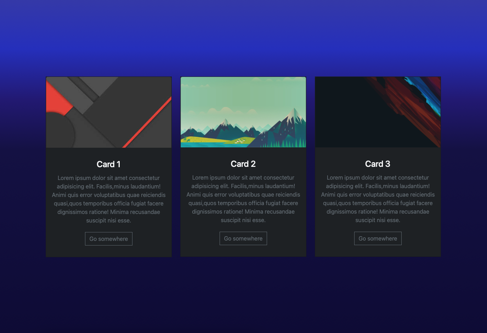

# CARDS CON REACT Y BOOTSTRAP

Ejercicio tomado desde el canal de youtube de faztweb para aprender el uso de componentes de **_react_** en este caso unas tarjetas, ademas practicar el uso de **_bootstrap_** para estilizar los componentes. Tambien se agregaron algunas animaciones con la libreria animate.css al momento de cargar la pagina.

---

### ScreenShot

---
